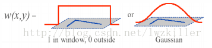
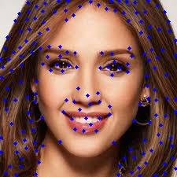
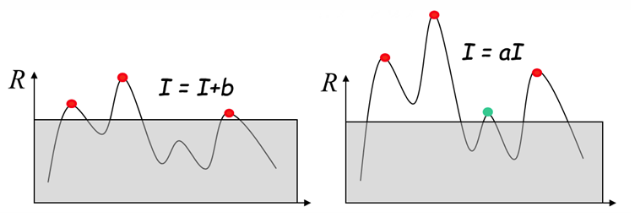
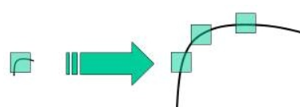

# Task01 Harris特征点检测器-兴趣点检测

**特则点**又称为兴趣点或角点，通常具有旋转不变性和光照不变性和视角不变性等优点，是图像的重要特征之一，常被应用到目标匹配、目标跟踪、三维重建等应用中。

**点特征**主要是指图像中的明显点，如突出的角点、边缘端点、权值点等等。

**兴趣点提取(检测)算子**是用于点特征提取的算子，常用的有

- Harris角点检测：用于检测角点
- FAST特征检测：用于检测角点
- SIFT特征检测：用于检测斑点
- SURF特征检测：用于检测角点
- BRIEF特征检测：用于检测斑点
- ORB：该算法代表带方向的FAST算法和具有旋转不变性的BRIEF算法

**特征匹配**：

- 暴力(Brute-Force)匹配法
- 基于FLANN匹配法

## 一、Harris特征点检测算法的思想和数学原理

## 1.1 基础知识

- **角点**

  左图表示一个平坦区域，在各个方向移动，窗口内像素值均没有太大变化；

  中图表示一个边缘特征(Edges)，若沿着水平方向移动(梯度方向)，像素值会发生跳变；若沿着边缘移动(平行于边缘)，像素值不变发生变化；

  右图表示一个角(Corners)，它朝哪个方向移动，像素值都会发生很大变化。即为<font color=red>角点</font>。


- **图像梯度**:图像局部内，图像梯度越大表示该局部内像素值变化越大。图形梯度在数学上可用微分或者积分表示,使用差分来近似导数：$G_x(x,y)=H(x+1,y)-H(x-1,y)$,
- **补充**：对图像求梯度通常是考虑图像的每个像素的某个领域内的灰度变化，因此通常对原始图像中像素某个领域设置梯度算子，然后采用小区域模板进行卷积计算，常用的有Prewitt算子、Sobel算子、Robinson算子、Laplace算子等。

## 1.2 Harris角点检测算法原理

### 1.2.1 计算窗口内部的像素值变化量$E(x,y)$

**建立数学模型，确定哪些窗口会引起较大的灰度值变化**

窗口$W$对应的像素坐标位置$(x,y)$，窗口的大小决定了有多少位置。

像素位置坐标$(x,y)$对应的像素灰度值为$I(x,y)$，窗口分别向$x$和$y$方向上移动$(u,v)$，到达$(x+u,y+v)$上，对应的像素灰度值$I(x+u,y+v)$。

窗口移动引起的灰度值的变化量为$I(x+u,y+v)-I(x,y)$。

$(x,y)$位置的窗口函数为$w(x,y)$。即为窗口内各像素的权重。



**窗口移动(u,v)引起的灰度值的加权变化量**：
$$
E(u,v) = \sum_{x,y}{w(x,y){[I(x+u,y+v)-I(x,y)]}^{2}}
$$
根据二维泰勒公式展开：
$$
\begin{equation}
\begin{aligned}
E(u,v) &\approx \sum_{x,y \in W}{w(x,y){[I(x,y)+uI_x+vI_y-I(x,y)]}^{2}} \\
  &= \sum_{x,y\in W}{w(x,y){(uI_x+vI_y)}^{2}} \\
   &= \sum_{x,y\in W}{w(x,y){(u^2I_x^2+vI_y^2+2uvI_xI_y)}^{2}} \\
  &= \sum_{x,y\in W}{w(x,y)\begin{bmatrix}u&v\end{bmatrix}\begin{bmatrix}I_x^2 & I_xI_y\\
                                       I_xI_y & I_y^2\end{bmatrix} \begin{bmatrix}u\\v\end{bmatrix}} \\
  &= \begin{bmatrix}u&v\end{bmatrix}(\sum_{x,y\in W}{w(x,y) \begin{bmatrix}I_x^2 & I_xI_y\\ I_xI_y & I_y^2\end{bmatrix} })\begin{bmatrix}u\\v\end{bmatrix}                                      \\
  &= \begin{bmatrix}u&v\end{bmatrix}M\begin{bmatrix}u\\v\end{bmatrix}
\end{aligned}
\end{equation}
$$
其中$I_x,I_y$分别为窗口内像素点$(x,y)$在$x$方向上和$y$方向上的梯度值。矩阵$M$为：
$$
\begin{equation}
\begin{aligned}
M &= \sum_{(x,y)\in W}{w(x,y) \begin{bmatrix}I_x^2 & I_xI_y\\
                                       I_xI_y & I_y^2\end{bmatrix}}\\
  &=R^{-1}\begin{bmatrix}\lambda_1 & 0\\0 & \lambda_2\end{bmatrix}R
\end{aligned}
\end{equation}
$$
最后使用实对称矩阵对角化处理后得到我们想要的结果。

### 1.2.2 计算对应的角点响应函数$R$

通过矩阵的梯度变化可以得到协方差矩阵M，协方差矩阵M决定了灰度值的加权变化量。因此通过计算**角点响应函数R**得到每个窗口对应的得分:

$$
R = det(M)-k(trace(M))^2
$$
其中$det(M)=\lambda_1\lambda_2$为矩阵的行列式，$trace(M)=\lambda_1+\lambda_2$为矩阵的迹。

$k$是一个经验常数，需要经验确定它的合适大小，通常在(0.04,0.06)之间取值。

### 1.2.3 角点判定

根据R值判断窗口是平面、边缘还是角点：

- 平面：$|R|$值非常小，$\lambda_1$和$\lambda_2$都较小，窗口区域的像素点的梯度变化小。
- 边缘：$|R|$值为负数，$\lambda_1 \gg \lambda_2$或$\lambda_2 \gg \lambda_1$，像素点的某个方向的梯度幅值变化比较明显，另一个方向上的梯度变化比较弱。
- 角点：$|R|$值很大，$(I_x,I_y)$对应的$\lambda_1$和$\lambda_2$都很大。像素点的梯度分布比较散，梯度变化程度比较大。

如下图所示：


Harris角点检测：设定一个阈值，高于阈值的像素对应角点。

- 补充：角点的非极大值原理--在一个窗口内，如果有很多角点则用值最大的那个角点，其他的角点都删除。

## 1.3 Shi-Tomasi角点检测器

**Shi-Tomasi 角点检测**：《Good_Features_to_Track》论文提出的Harris改进版。

Harris角点检测中每个窗口的分数公式：$R=\lambda_1\lambda_2 - k(\lambda_1+\lambda_2)^2$

缺陷：Harris角点检测算法的稳定性和k值有关，但k是经验值，不好设定最佳值。

改进：角点稳定性与矩阵$M$的较小特征值有关，Shi-Tomasi 直接采用较小的特征值作为分数。(如此一来就不用调整k值啦)

Shi-Tomasi角点检测中每个窗口的分数公式：$R=min(\lambda_1,\lambda_2)$

判定角点的方式不变：分数大于设定的阈值，即为角点。

## 二、OpenCV的Harris算子进行兴趣点检测

## 2.1 Harris角点检测

**opencv**提供了实现**Harris**角点检测函数：[cv2.cornerHarris](https://link.zhihu.com/?target=https%3A//docs.opencv.org/master/dd/d1a/group__imgproc__feature.html%23gac1fc3598018010880e370e2f709b4345)，下面调用该接口进行**Harris**特征点检测。

函数：**cv2.cornerHarris(src, blockSize, ksize, k[, dst[, borderType]])​**

函数功能：对于每一个像素 $(x,y)$，在 ($blockSize$ x $blockSize$) 邻域内，计算梯度图的协方差矩阵$M(x,y)$，通过计算角点响应函数得到结果图。该结果图的局部最大值即图像中的角点。

函数参数：

- **src**:待检测的灰度图像(float32类型)
- **blockSize**:用于角点检测的领域大小，即窗口尺寸
- **ksize**:用于计算梯度图的Sobel算子的尺寸
- **k**:用于计算角点响应函数的参数k，取值范围在0.04~0.06之间

待检测的图片：


```python
import cv2 as cv
from matplotlib import pyplot as plt
import numpy as np

# 检测参数
block_size = 3
sobel_size = 3
k = 0.06

image = cv.imread('image1.jpg')
print(image.shape)
height = image.shape[0]
width = image.shape[1]
channels = image.shape[2]
print("width: %s height: %s channel: %s"%(width, height, channels))
# 将图像转换为灰度图
gray_img = cv.cvtColor(image, cv.COLOR_BGR2GRAY)
# 将数据格式转换为32位浮点数
gray_img = np.float32(gray_img)

# 使用合适值作为输入参数检测角点，得到的结果图用来标出角点
corners_img = cv.cornerHarris(gray_img, block_size, sobel_size, k)
```

输出：

```tex
(225, 225, 3)
width: 225 height: 225 channel: 3
```

```python
kernel = cv.getStructuringElement(cv.MORPH_RECT,(3,3))
dst = cv.dilate(corners_img, kernel)
# dst = cv.dilate(corners_img,None)
# image[dst>0.05*dst.max()] = [255,0,0]
# num = dst > 0.05 * dst.max()
# count = np.sum(num)
# print(count)
count = 0
for r in range(height):
    for c in range(width):
        pix = dst[r,c]
        # 阈值，蓝色标记角点
        if pix > 0.05 * dst.max():
            cv.circle(image,(c,r),2,(255,0,0),-1)
            count += 1
print(count)
cv.imwrite('harris_img1.jpg',image)
```

输出：

```tex
741
```

处理后图片如下：


```python
# 使用点画图，点小一点，好看一丢丢把。。。
image[dst>0.05*dst.max()] = [255,0,0]
```


## 2.2 Shi-Tomasi角点检测

opencv提供了实现Shi-Tomasi 角点检测函数：**cv2.goodFeaturesToTrack()**，下面调用该接口进行Harris特征点检测。

函数：**goodFeaturesToTrack(image, maxCorners, qualityLevel, minDistance[, corners[, mask[, blockSize[, useHarrisDetector[, k]]]]])**

函数功能：流程大体与Harris相似。不同之处在于窗口分数计算公式不同。在检测到的角点中，所有低于质量水平的角点都会被忽略，合格角点按角点质量进行降序排列，保留质量最高的一个角点，将它附近（最小距离之内）的角点都删掉（类似于非极大值抑制），按这样的方式最后得到 N 个最佳角点。

函数参数：

- **image**：输入灰度图像，float32类型
- **maxCorners**：返回角点的最大数目，值为0表表示不设置最大值限制，返回所有检测到的角点。
- **qualityLevel**：质量系数（小于1.0的正数，一般在0.01-0.1之间），表示可接受角点的最低质量水平。该系数乘以最好的角点分数（也就是上面较小的那个特征值），作为可接受的最小分数；例如，如果最好的角点分数值为1500且质量系数为0.01，那么所有质量分数小于15的角都将被忽略。
- **minDistance**：角之间最小欧式距离，忽略小于此距离的点。
- **corners**：输出角点坐标
- **mask**：可选的感兴趣区域，指定想要检测角点的区域。
- **blockSize**：默认为3，角点检测的邻域大小（窗口尺寸）
- **useHarrisDetector**：用于指定角点检测的方法，如果是true则使用Harris角点检测，false则使用Shi Tomasi算法。默认为False。
- **k**：默认为0.04，Harris角点检测时使用。

```python
import numpy as np
import cv2
maxCorners = 600
qualityLevel = 0.01
minDistance = 10

img = cv2.imread('image1.jpg')
gray = cv2.cvtColor(img, cv2.COLOR_BGR2GRAY)
corners = cv2.goodFeaturesToTrack(gray, maxCorners, qualityLevel, minDistance)
corners = np.int0(corners)
count = 0
for i in corners:
    x,y = i.ravel()
    cv2.circle(img,(x,y), 2, (255,0,0),-1)
    # img[y,x] = [255,0,0]
    count += 1
cv.imwrite('Shi-Tomasi.jpg',img)
img = cv2.cvtColor(img, cv2.COLOR_BGR2RGB)
print(count)
```



## 总结

Harris和Shi-Tomasi都是基于梯度计算的角点检测方式。

Harris角点检测的性质：

- 阈值界定角点数量

- Harris角点算子对亮度和对比度的变化不敏感

  因为在进行Harris角点检测时，使用了微分算子对图像进行微分运算，而微分运算对图像密度的拉升或收缩和对亮度的抬高或下降不敏感。换言之，对亮度和对比度的仿射变换并不改变Harris响应的极值点出现的位置，但是，由于阈值的选择，可能会影响角点检测的数量。

  

  左图表示亮度变化，右图表示对比度变化。

- Harris角点检测算子具有旋转不变性

  Harris角点检测算子使用的是角点附近的区域灰度二阶矩矩阵。而二阶矩矩阵可以表示成一个椭圆，椭圆的长短轴正是二阶矩矩阵特征值平方根的倒数。当特征椭圆转动时，特征值并不发生变化，所以判断角点响应值RR也不发生变化，由此说明Harris角点检测算子具有旋转不变性。

- Harris角点检测算子不具有尺度不变性

  

  如上图所示，当图像被缩小时，在检测窗口尺寸不变的前提下，在窗口内所包含图像的内容是完全不同的。左侧的图像可能被检测为边缘或曲线，而右侧的图像则可能被检测为一个角点。

基于梯度的角点检测器的缺点：计算复杂度高、图像中的噪声阻碍梯度计算。

## 参考

[Task01 Harris特征点检测器-兴趣点检测](https://github.com/datawhalechina/team-learning/blob/master/03%20%E8%AE%A1%E7%AE%97%E6%9C%BA%E8%A7%86%E8%A7%89/%E8%AE%A1%E7%AE%97%E6%9C%BA%E8%A7%86%E8%A7%89%E5%9F%BA%E7%A1%80%EF%BC%9A%E5%9B%BE%E5%83%8F%E5%A4%84%E7%90%86%EF%BC%88%E4%B8%8B%EF%BC%89/Task01%20Harris%E7%89%B9%E5%BE%81%E7%82%B9%E6%A3%80%E6%B5%8B.md)

[角点检测：Harris 与 Shi-Tomasi](https://zhuanlan.zhihu.com/p/83064609)

[Harris角点检测原理(赋源码)](https://www.cnblogs.com/zyly/p/9508131.html)

